# CFUV Scheduling
Это домашняя страница проекта CFUV Scheduling

### Что такое CFUV Scheduling?
CFUV Scheduling – это приложение, которое помогает оптимизировать планирование и администрирование расписания занятий для ВУЗов.

Ключевые возможности CFUV Scheduling:

1. Гибкое управление расписанием:
  + Добавление новых дисциплин и формирование групп
  + Составление расписания занятий с учетом загруженности аудиторий и преподавателей
  + Оперативное внесение изменений в расписание 
2. Удобное информирование студентов и преподавателей:
  + Предоставление актуального расписания в доступном формате
  + Автоматические уведомления об изменениях в расписании
3. Налаживание коммуникации между студентами и преподавателями:
  + Возможность оставления комментариев преподавателями для конкретных пар
  + Планирование и проведение консультаций перед экзаменами

Использование CFUV Scheduling повышает эффективность организации учебного процесса, обеспечивая прозрачность расписания и укрепляя взаимодействие между студентами и преподавателями. Это незаменимый инструмент для оперативного управления расписанием в современном вузе. Ниже будет предоставлена подробная документация по использованию данного приложеения.

### Регистрация
В первый раз вы войдёте в качестве гостя. Чтобы начать полноценную работу с приложением, вам необходимо будет зарегестрироваться.

Сделать это можно будет следующим образом:
1. Перейдите на страницу "Аккаунт" и нажмите на кнопку "Войти" в правом верхнем углу экрана.
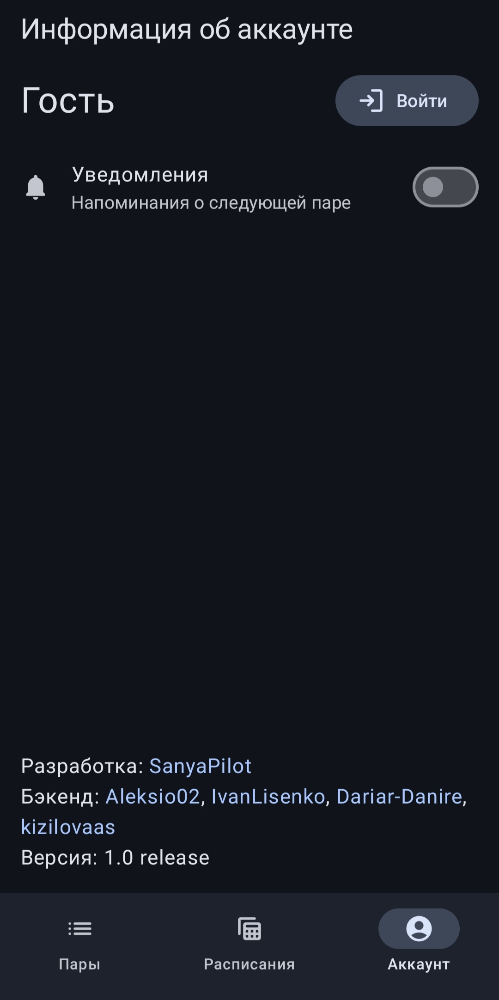

3. В появившемся окне нажмите кнопку "Зарегистрироваться".
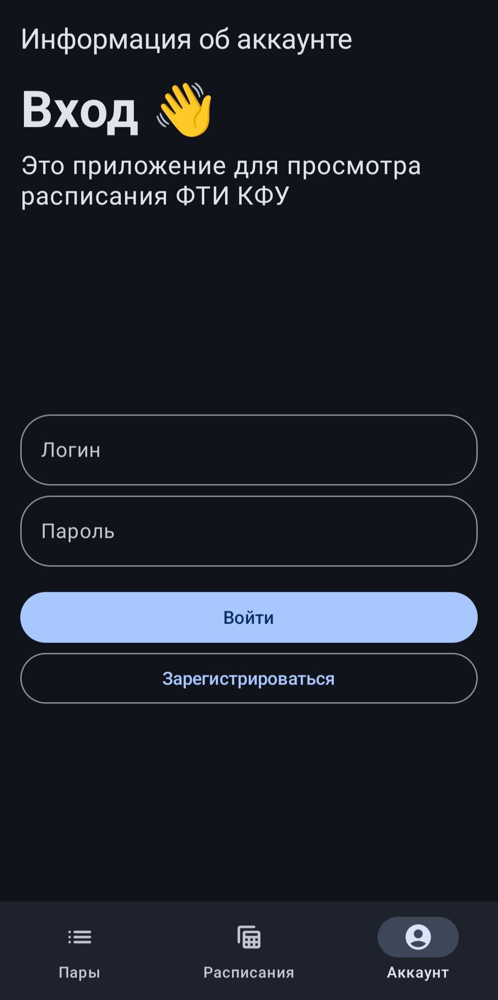

4. В следующем окне укажите имя своего пользователя и пароль. Минимальная длина пароля - 8 символов.
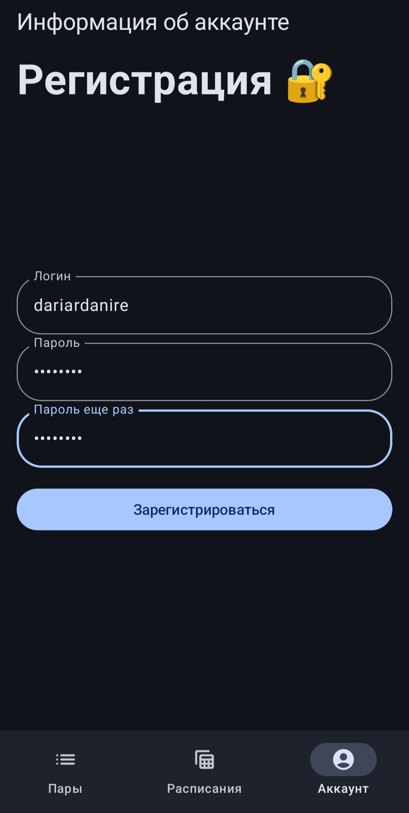

4. После этого вы увидете во вкладке "Аккаунт" имя своего пользователя и свою текущую роль. Сразу после регистрации в поле роли будет указано "Пользователь".

### Выход из аккаунта
Чтобы выйти из аккаунта, перейдите на вкладку "Аккаунт" и там нажмите кнопку "Выйти".
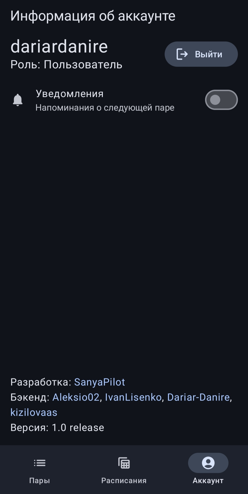

### Авторизация
Для повторного входа в систему необходимо выполнить следующие дейтсвия:
1. Перейдите на вкладку "Аккаунт" и нажмите кнопку "Войти"

3. Укажите логин и пароль вашего пользователя и нажмите кнопку "Войти"
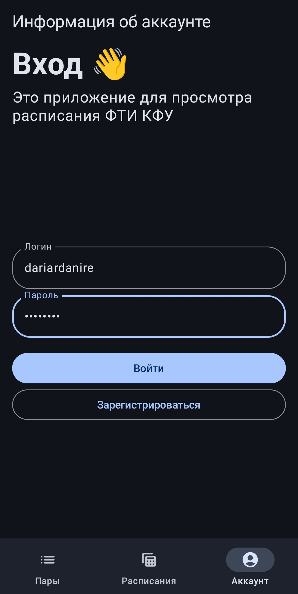

### Просмотр расписания
#### Выбор группы
Выбрать группу можно на вкладке "Расписания". Перейдя на вкладку, просто переместите флажок на нужную группу.

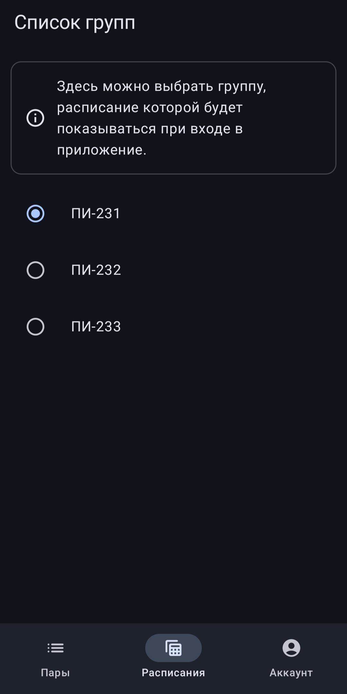

#### Страница просмотра расписания
Список пар на текущий день показан на вкладке "Пары". Здесь вы можете просмотреть список пар на сегодня, прочитать комментарии к парам, оставленные преподавателями, а также увидеть какие преподаватели ведут пары.
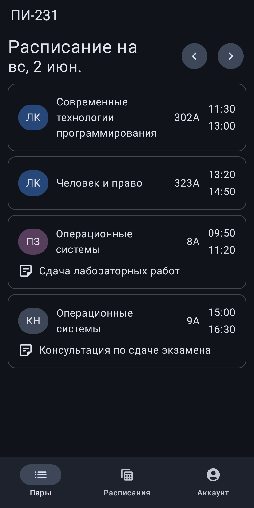

Чтобы увидеть более подробную информацию о паре, нажмите на нужную вам пару.
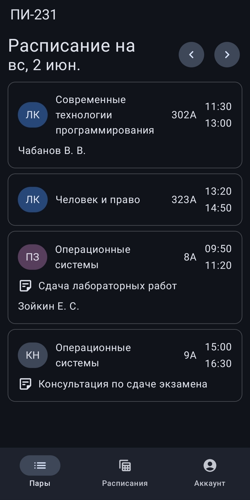

#### Переключение даты
Чтобы просмотреть расписание на другой день, наклацайте стрелочками нужную дату. Стрелочка влево показывает дни до текущего, стрелочка вправо - дни после текущего.
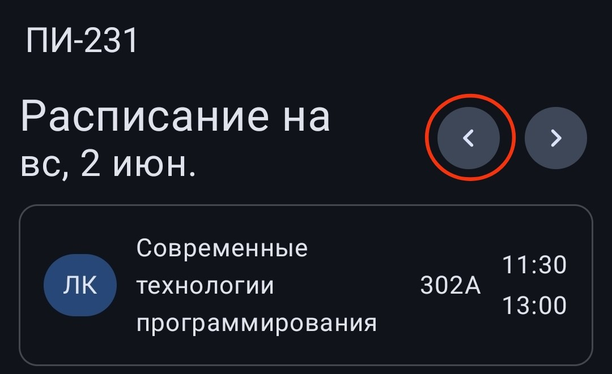
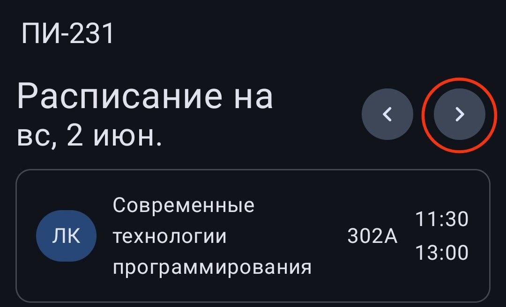

#### Включение уведомлений и следующей паре
В CFUV Scheduling есть возмонжость напоминания о следующей паре. Чтобы включить напоминение, нужно на вкладке "Аккаунт" включить опцию "Уведомления".

#### Дополнительный функционал преподавателя
Преподаватель дополнительно может добавлять и удалять консультации, а также писать комментарии к своим парам. Работать с чужими парами преподаватель не может.

#### Добавление комментария к своей паре
Если вы зашли в аккаунт с ролью "Преподаватель", то у вас появляется возможность оставлять комментарии к своим парам. Для этого нужно:
1. Нажать на свою пару, к которой вы хотите оставить комментарий, и нажать "Пометка"
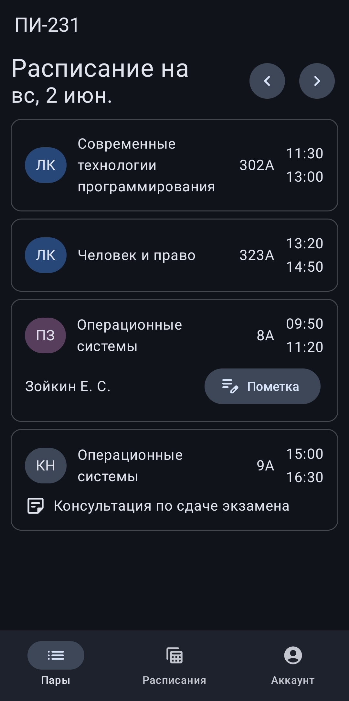

4. В появившемся поле ввести комментарий и подтвердить изменения кнопкой "Ок"
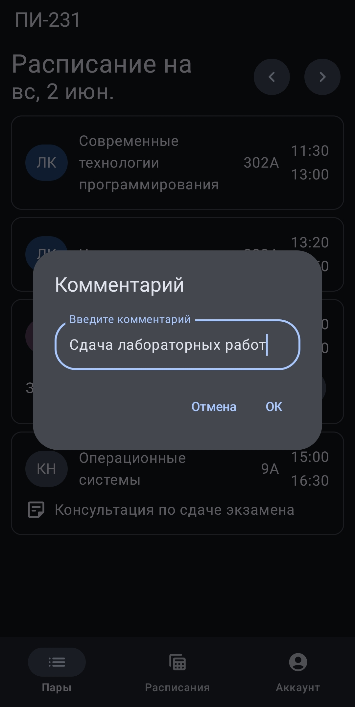

#### Добавление и удаление консультации
Если вы зашли в аккаунт с ролью "Преподаватель", у вас также появится возможность добавлять консультации по своим предметам.
Чтобы добавить консультацию, необходимо:
1. Нажать на "+" в правом нижнем углу экрана.
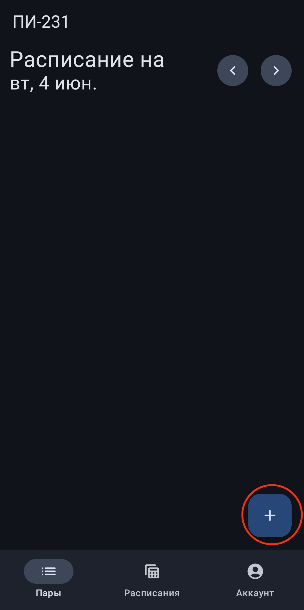

2. В появившемся окне заполнить название предмета, кабинет, дату и номер пары. Поле "Комментарий" не обязательное, его можно оставить пустым.
3. Нажать кнопку "Сохранить"
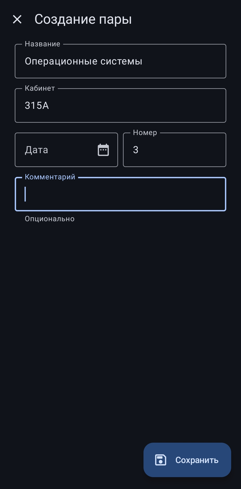

Дату при заполнении данных о новой паре можно указать через календарь. Для этого нажмите на календарик в поре "Дата" и в появивишемся календаре выберите нужную дату.
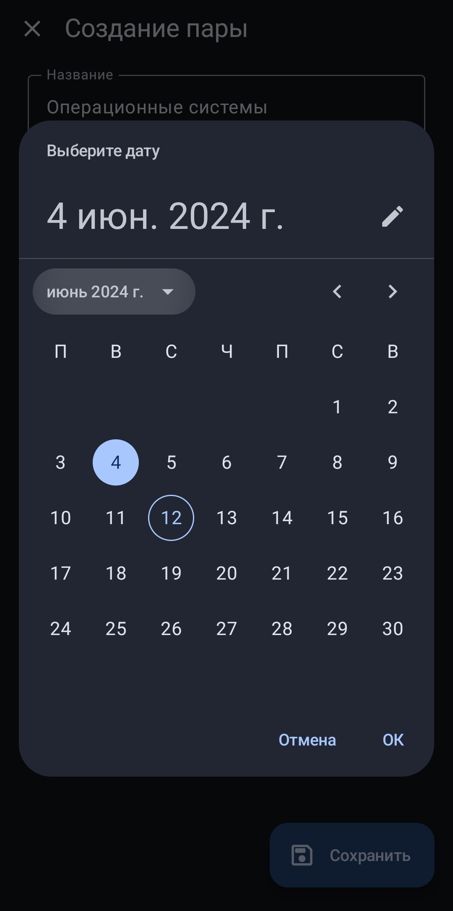

5. Чтобы удалить консультацию, достаточно развернуть подробную информацию о консультации и нажать на значок мусорной козрины.
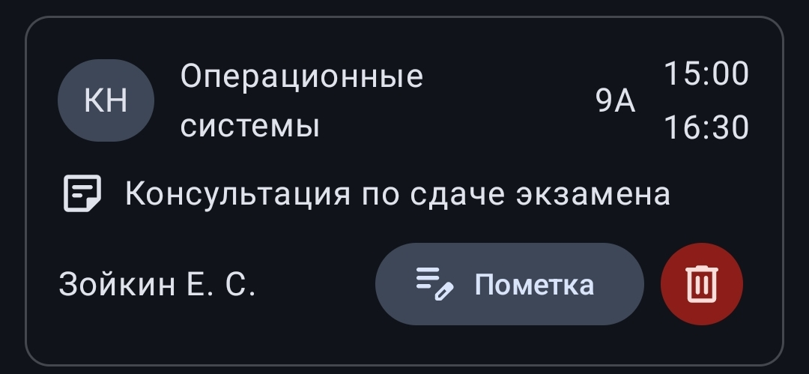

### Составление расписания администраторами
Администраторы в CFUV Scheduling занимаются составлением расписания. У них есть две возможности: добавять и удалять пары.

#### Добавление пары
Чтобы добавить пару, необходимо:
1. Нажать на "+" в правом нижнем углу экрана.

3. В появившемся окне заполнить все обязательные поля. Поле "Комментарий" необязательно, его можно пропустить.
3. Нажать кнопку "Сохранить".
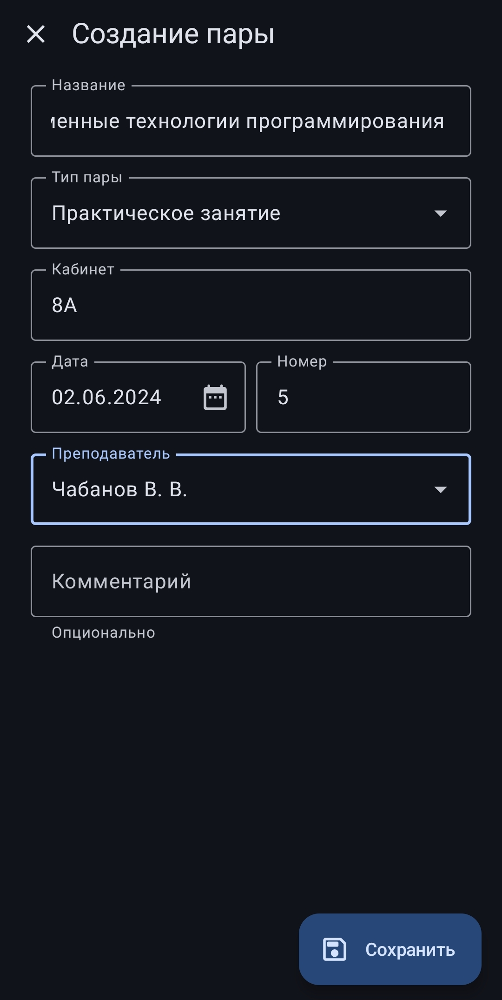

Пара не добавится в расписание указанного дня, если пара с таким номером уже существует. Поэтому заранее проверяйте наличие пары нужным вам номером.

#### Удаление пары
В отличие от преподавателей, администраторы могут удалять любые пары. Для этого нужно показать более подробную информацию о паре и нажать на значок мусорной карзины. Мы можем увидеть это, развернув информацию о парах для всех предметов:
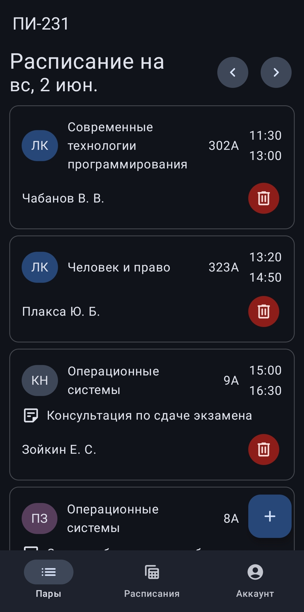